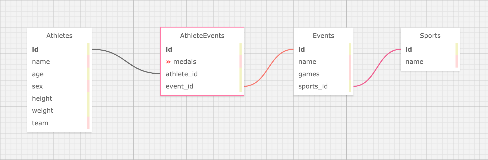

# README

## Introduction

The production app is located at https://stormy-lake-75994.herokuapp.com/

## Initial Setup

Clone this repository to your computer.  Once it has been cloned, run `bundle`.  After bundling, run `rake db:{create,migrate}`.  Next, seed the database by running `rake import:olympians`.

## Running Tests

The application was created with RSpec.  To run the test suite, enter `rspec` from the command line.  

SimpleCov was used for monitoring testing coverage.

## How To Use

## Tech Stack

## Schema

The database consists of four tables: Athletes, AthleteEvents, Events and Sports.  A diagram of the schema is shown below.

## Known Issues

## Core Contributors

This was a solo project created by Earl Stephens: https://github.com/earl-stephens

## How to Contribute

If you would desire to contribute to the project, fork the project from the master branch.  You can then make the changes you think are appropriate and submit a pull request.  Please provide a detailed explanation in the pull request of what the problem or fix is.
